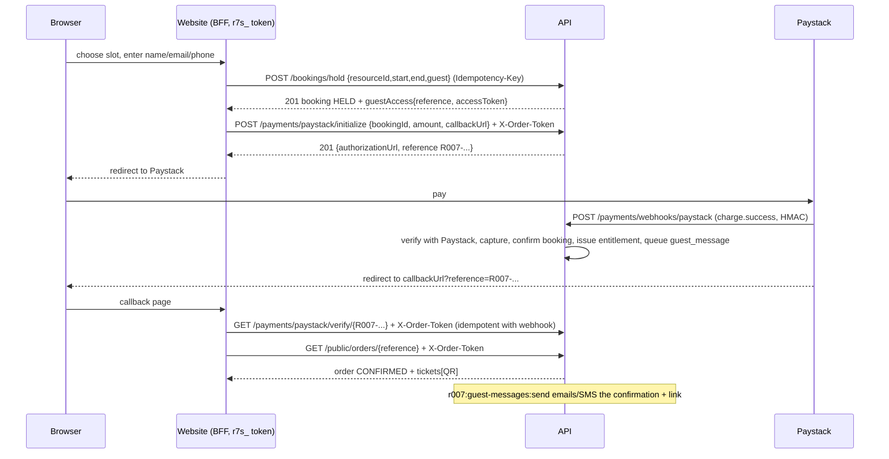
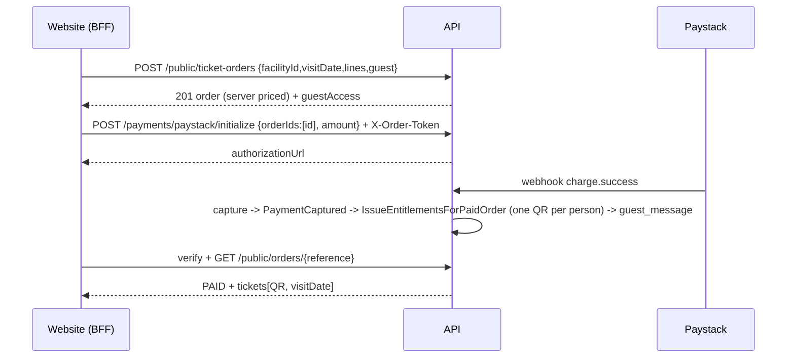

# Guest checkout (book / buy without an account)

Contract for the website (`007resort-booking-web`). Owner requirement: a visitor can book a slot, buy tickets or buy a membership at the
point of payment by giving only **name, email and phone**, and it must not feel like creating an account. Customers who DO have an account
keep logging in exactly as today (`CUSTOMER_PUBLIC_API.md`); nothing in that contract changes. Everything is under `/api/v1`, camelCase
JSON, RFC 7807 `application/problem+json` errors with a stable `code`, money as decimal strings.

## 1. Model (what is stored, what is not)

* **No account, no `customer` row, no login-capable identity is ever created by guest checkout.** Bookings, orders and memberships are
  stored with `customer_id = NULL` and a **contact snapshot** (`contact_name`, `contact_email` (normalised lower-case), `contact_phone`
  (E.164)). Existing columns are reused where they exist (`booking.customer_name|email|phone`, `order.customer_name`).
* One checkout = one **guest order** (`guest_order`): a public `reference` (`GC-` + 8 chars of Crockford base32, e.g. `GC-7K3M9X2Q`), the
  purchase it wraps (exactly one of `bookingId`, `orderId` (ticket order), `membershipId`), the contact snapshot, the consent record (version,
  timestamp, marketing opt-in), and `claimedCustomerId` (set only by claiming, section 8).
* Each guest order has **access tokens** (`r7o_` + 32 random bytes base64url). Only `SHA-256(token)` is stored (`guest_access_token`);
  the plaintext is returned once in the create/confirm/lookup response. A token authorises read/manage of **that one guest order only**.
* `guest_contact` (separate from `customer`): de-duplicates repeat guests per organisation by normalised email for reporting; it is never
  used to log anyone in, never returned by any endpoint and never matched against accounts.
* Guest orders show up in admin/POS/reporting lists through the contact snapshot; every query tolerates `customer_id IS NULL`.

## 2. Credentials and scope

The website calls the API server-to-server with its service token `Authorization: Bearer r7s_...`. `service_token.scope` is a comma-set;
guest checkout needs the new scope **`public.checkout`** (existing: `public.read`; social login adds `customer.social`). A service token
without it gets `403 scope_denied` on every guest write. Issue the website token with:

```
php artisan r007:service-token create --name=booking-web --scope=public.read,public.checkout
```

The dev token `r7s_dev_booking_web` (demo seeder) gets `public.read,public.checkout`.
Browsers never talk to these endpoints (they hold no `r7s_` token); the website forwards the visitor's IP in `X-Client-IP` (trusted for
service tokens only) so per-IP abuse limits are about the visitor, not about the website.

Two ways to identify the guest, depending on the call:

| Call | How the guest is identified |
| --- | --- |
| **Create** (`POST /bookings/hold`, `POST /public/ticket-orders`, `POST /memberships`) | `guest` object in the body (section 3) with `Authorization: Bearer r7s_...`. Or a customer token exactly as today (then `guest` must be absent: `422 validation_failed`). |
| **Everything after** (confirm, pay, cancel, read, resend) | `Authorization: Bearer r7s_...` **plus header `X-Order-Token: r7o_...`**. The id in the path must belong to the token's guest order, otherwise `404 not_found` (indistinguishable from a missing id). |
| **Find an order** (`POST /public/orders/lookup`) | `reference` + `email` or `phone` (section 6). |

A bad token is `401 order_token_invalid`, an expired one `401 order_token_expired` (offer the lookup form). A valid token used on a path
that is not its order is `404 not_found`.

## 3. The `guest` object

```json
"guest": {
  "name": "Ada Lovelace",
  "email": "Ada@Example.com",
  "phone": "0803 123 4567",
  "marketingConsent": false,
  "consentVersion": "2026-09",
  "captchaToken": "optional, only when Turnstile is enabled"
}
```

| Field | Rules |
| --- | --- |
| `name` | required, trimmed, 2..120 chars, must contain a letter |
| `email` | required, RFC-valid (`filter_var` + length <= 254), stored lower-case + trimmed. **MX is not checked.** |
| `phone` | required, normalised to E.164. Nigerian defaults: `0803...` -> `+234803...`, `234803...` and `+234803...` accepted, spaces/dashes/brackets stripped. Nigerian numbers must be 10 national digits after the `0` / `+234` and start `7|8|9`. Other countries: any `+` number matching `^\+[1-9]\d{7,14}$` when `GUEST_ALLOW_INTERNATIONAL_PHONES=true` (default). Anything else `422`. The response echoes the normalised value. |
| `marketingConsent` | optional bool, default false. Never pre-ticked by the API; store exactly what the visitor chose. |
| `consentVersion` | required string 1..32: the version id of the privacy/terms text the website showed at checkout. The API stores `consent_version` + `consented_at` (server time) for NDPR evidence. |
| `captchaToken` | required only when `GUEST_TURNSTILE_SECRET` is set (section 9). |

Validation failures are the standard `422 validation_failed` with `errors` keyed `guest.name`, `guest.email`, `guest.phone`,
`guest.consentVersion` (dot paths, same shape as every other 422).

## 4. Endpoints

All mutating endpoints take `Idempotency-Key` (namespaced per service token). Replays return the original body including the one-time
`accessToken`.

### 4.1 Create

Every create response is the normal body of that endpoint **plus**:

```json
"guestAccess": { "reference": "GC-7K3M9X2Q", "accessToken": "r7o_...", "accessTokenExpiresAt": "2026-12-31T00:00:00.000Z", "contact": { "name": "Ada Lovelace", "email": "ada@example.com", "phone": "+2348031234567" } }
```

* `POST /bookings/hold` (slots, courts, venues, sessions) - body as today plus `guest` (instead of a customer token). `201`, `booking.status = HELD`,
  `holdExpiresAt`, `channel = ONLINE`, `customerId = null`, `customer` = the contact snapshot.
  Errors as today (`409 slot_unavailable`, `409 site_offline`, `409 capability_disabled`, `422 ...`) plus guest errors (section 7).
* `POST /public/ticket-orders` (pool / day pass / any ticket product) - body as today plus `guest`. `201`, unpaid ONLINE order priced by the server.
* `POST /memberships` - body `{planId, guest}` (the staff `customer` field is not used). `201`, `status = PENDING_PAYMENT`, holder = contact snapshot.
* Events with ticket products are ticket products: they go through `POST /public/ticket-orders`. There is no separate online food/retail order flow
  in the API today; when one exists it will use the same `guest` object.

### 4.2 Pay (Paystack)

`POST /payments/paystack/initialize` with `Authorization: Bearer r7s_...` + `X-Order-Token`, body
`{"bookingId": "..."}` | `{"orderIds": ["..."]}` | `{"membershipId": "..."}` plus `amount` (must equal the amount due, decimal string) and `callbackUrl`.
`email` in the body is ignored for guests: Paystack receives the guest's contact email. Response as today
`{paymentId, reference, authorizationUrl, accessCode}` (`reference` here is the **Paystack** reference `R007-...`, not the guest reference).

`GET /payments/paystack/verify/{paystackReference}` (service token + `X-Order-Token`): asks Paystack, capture is idempotent with the webhook.
Call it from the website's callback page after Paystack redirects the browser to `callbackUrl` (`?reference=R007-...`).
`POST /payments/webhooks/paystack` is unchanged (HMAC, idempotent). Capture confirms the booking / activates the membership / issues the
ticket entitlements and queues the delivery message (section 5).

### 4.3 Read / manage (service token + `X-Order-Token`)

| Method | Path | Notes |
| --- | --- | --- |
| GET | `/public/orders/{reference}` | Guest order view (below). The token must belong to `{reference}`. |
| GET | `/bookings/{id}` | The guest's own booking (ETag as today). |
| POST | `/bookings/{id}/confirm` | Same as accounts (`If-Match`, optional `paystackReference`). Tenders are refused (staff only). |
| POST | `/bookings/{id}/cancel`, `/bookings/{id}/reschedule` | Same rules as accounts (cancellation window, rule engine, refund record, audit). |
| GET | `/entitlements/{id}` | One ticket / QR entitlement of the guest order. |
| GET | `/memberships/{id}` | The guest's membership incl. cards. |
| POST | `/public/orders/{reference}/resend` | `{ "channel": "EMAIL" \| "SMS" }` -> `202 {queued:true}`. Rate limited (section 9). `409 nothing_to_send` until the order is paid/confirmed. |
| POST | `/public/orders/{reference}/create-account` | Optional, `{ "password": "...", "termsAccepted": true }` -> `202`. Starts a normal password registration for the order's email (unverified). Nothing is claimed until the person verifies the email through the normal verification step (section 8). Generic answer whether or not an account with that email already exists. |

Guest order view (`GET /public/orders/{reference}`):

```json
{
  "reference": "GC-7K3M9X2Q",
  "kind": "BOOKING",                     // BOOKING | TICKETS | MEMBERSHIP
  "status": "CONFIRMED",                 // BOOKING: booking status; TICKETS: PENDING_PAYMENT|PAID|CANCELLED; MEMBERSHIP: membership status
  "paid": true,
  "amountDue": "0.0000", "currency": "NGN",
  "contact": { "name": "Ada Lovelace", "email": "ada@example.com", "phone": "+2348031234567" },
  "claimed": false,
  "createdAt": "...Z",
  "booking": { /* Booking (BookingPresenter, incl. policy{canCancel,...}) or null */ },
  "ticketOrder": { /* TicketOrder or null */ },
  "membership": { /* Membership incl. cards, or null */ },
  "tickets": [ { /* Entitlement incl. qrToken and items - same shape accounts get */ } ]
}
```

`tickets` is empty until payment is captured; after that it carries the QR entitlements exactly as `/customer/entitlements` does.

### 4.4 Staff-side (existing endpoints, now guest-aware)

Admin/POS booking, order, membership and entitlement lists and receipts show guest orders using the contact snapshot; `customerId` is
`null`. New staff endpoint: `POST /guest-contacts/erasure` (permission `config.manage`, `Idempotency-Key`) `{ "email"?: "...", "phone"?: "...", "reference"?: "GC-..." }` -> `200 {anonymised: {guestOrders, bookings, orders, memberships, entitlements}}` (section 9). CLI equivalent: `php artisan r007:guest-erase --email=... | --phone=... | --reference=...`.

## 5. Ticket / confirmation delivery

When a guest order becomes paid/confirmed, the API writes rows to `guest_message` (the outbox) in the same transaction as the capture:
`EMAIL` and `SMS` to the snapshot contact (`template = CONFIRMATION`). A sender command (`php artisan r007:guest-messages:send`, scheduled every minute)
delivers them: email through Laravel Mail (driver `log` on the demo server until SMTP is configured; the message carries the reference, the
summary and a link `{GUEST_WEB_URL}/order/{reference}?token={freshAccessToken}`), SMS through the `SmsSender` interface (default `LogSmsSender`: stub, no
provider yet). Failed sends retry with backoff (max 5 attempts, then `FAILED`). The website should therefore serve `GET /order/{reference}?token=...`
(server side: `GET /public/orders/{reference}` with that token as `X-Order-Token`).

## 6. Lookup (find my booking)

`POST /public/orders/lookup` (service token with `public.checkout`, **no** order token; no `Idempotency-Key` needed because it mints a new token):

```json
{ "reference": "GC-7K3M9X2Q", "email": "ada@example.com" }      // or "phone": "0803..."
```
`200`: the guest order view of section 4.3 **plus** `guestAccess` (a **fresh** token; older tokens keep working until they expire, at most 5 active).
Reference AND the matching contact (normalised email or phone, compared in constant time) are required. Every failure is the same
`404 order_not_found` ("We couldn't find an order with those details.") whether the reference does not exist, the contact does not match, or the
order is erased. Strict limits per client IP, per reference and per email/phone (`429 rate_limited` + `Retry-After`).
While email is not configured the fresh token is returned to the calling website only (as above); later the same endpoint can additionally
email the link without changing the contract.

## 7. Error codes (guest specific; standard codes as in `docs/openapi`)

| HTTP | `code` | When |
| --- | --- | --- |
| 401 | `unauthenticated` | no / invalid service token |
| 403 | `scope_denied` | service token lacks `public.checkout` |
| 401 | `order_token_invalid` / `order_token_expired` | bad / expired `X-Order-Token` |
| 404 | `not_found` | id not in the token's guest order (or plain missing) |
| 404 | `order_not_found` | lookup mismatch (generic) |
| 422 | `validation_failed` | invalid `guest.*` fields; `guest` and a customer token together |
| 422 | `guest_required` | service token create call without a `guest` object |
| 422 | `captcha_required` / `captcha_failed` | Turnstile enabled and token missing / rejected |
| 409 | `too_many_active_holds` | the contact already has `GUEST_MAX_ACTIVE_HOLDS` live holds |
| 429 | `rate_limited` | guest creation, lookup or resend limits (`Retry-After`) |
| 409 | `nothing_to_send` | resend before payment |
| 403 | `guest_checkout_disabled` | `GUEST_CHECKOUT_ENABLED=false` |
| 409 | `slot_unavailable`, `hold_expired`, `site_offline`, `amount_mismatch`, `balance_changed`, ... | unchanged from accounts |

## 8. Claiming (attach past guest purchases to a real account)

Only when an account's email is **verified** (password registration + verification code/link, or a social login reporting `emailVerified=true`):
`GuestOrderClaimer::claim(Customer, verifiedEmail)` attaches every unclaimed guest order with that normalised email: `customer_id` is set on
the booking / ticket order (`customer_order`) / membership / entitlements, `guest_order.claimed_customer_id` + `claimed_at` are set, and an audit row
`guest.order.claim` is written per order. It is never called for an unverified email and never matches on phone. Wired into
`CustomerAuthService::verify`; the social-login branch must call it where it marks an email verified (integration point documented there).
After claiming, the orders appear in `/customer/bookings|entitlements|memberships`; the guest token keeps working until it expires.
Whether an email belongs to an account is never disclosed by any guest endpoint.

Integration point for the social-login branch: wherever a customer's email becomes verified (`emailVerified=true` from a trusted provider, link confirmation, email-change
verification) call `app(App\Domain\Guest\Services\GuestOrderClaimer::class)->claim($customerId, $verifiedEmail)`. The claimer re-checks in the DB that the customer's
`customer_account.login_email` equals that email and `email_verified_at` is set, so a call for an unverified email is a no-op.

## 9. Security, abuse and privacy

* **Tokens**: 256-bit, hashed at rest, per guest order, scoped to that order's ids only, expiring (`GUEST_ACCESS_TTL_DAYS`, default 90), revocable by erasure.
* **Rate limits** (Redis, per visitor `X-Client-IP`, contact, reference): creation per IP / email / phone per hour, lookup per IP / reference / contact,
  resend per order. `429 rate_limited` with `Retry-After`.
* **Holds**: at most `GUEST_MAX_ACTIVE_HOLDS` live holds per contact (email or phone; counted under a per-contact row lock so a race cannot exceed it); expired holds are cleaned by the existing `booking:expire-holds`.
  Slot double-booking guarantees are the existing MySQL ones, unchanged (guest and account holds contend on the same `slot_allocation` unique key).
* **CAPTCHA**: optional Cloudflare Turnstile. Off unless `GUEST_TURNSTILE_SECRET` is set; then `guest.captchaToken` is verified server-side and
  failures return `422 captcha_failed` (`captcha_required` when missing).
* **Privacy**: application logs and audit rows carry ids / hashed contact only, never full name/email/phone. No endpoint reveals whether an email or
  phone is known. Erasure (`r007:guest-erase` / `POST /guest-contacts/erasure`) anonymises contact snapshots (`Erased guest`, email/phone NULL),
  deletes the `guest_contact` row, revokes tokens and keeps the financial records (payments, receipts, ledger) untouched; the audit row stores an HMAC of the erased key.
  Retained on purpose (immutable ledger, legal retention): `payment.customer_email` of the Paystack payment and the receipt snapshot. Anonymised: `booking.customer_name|email|phone`,
  `customer_order.contact_*`, `order.customer_name`, `membership.contact_*`, `entitlement.holder_name`, `guest_order.contact_*`. Claimed orders (attached to a real account) keep the account's data.
* **Payments**: amounts are always server-computed; guest initialize enforces `amount == amountDue`; capture only after provider verification (unchanged).

## 10. Environment

`GUEST_CHECKOUT_ENABLED` (true), `GUEST_ACCESS_TTL_DAYS` (90), `GUEST_MAX_ACTIVE_HOLDS` (3), `GUEST_ALLOW_INTERNATIONAL_PHONES` (true),
`GUEST_RATE_CREATE_PER_IP_HOUR` (20), `GUEST_RATE_CREATE_PER_EMAIL_HOUR` (10), `GUEST_RATE_CREATE_PER_PHONE_HOUR` (10),
`GUEST_RATE_LOOKUP_PER_IP_15MIN` (10), `GUEST_RATE_LOOKUP_PER_REFERENCE_15MIN` (5), `GUEST_RATE_LOOKUP_PER_CONTACT_15MIN` (5),
`GUEST_RATE_RESEND_PER_ORDER_HOUR` (3), `GUEST_TURNSTILE_SECRET` (empty = off), `GUEST_WEB_URL` (falls back to `CUSTOMER_WEB_URL`).

## 11. Two-node note and gaps

Guest tables live on the node that serves the website (Cloud). Bookings / orders / memberships reach the Local node through the existing outbox events with the contact
snapshot (`customerId: null`); the `guest_*` tables themselves are not synced (Local staff never need the access tokens). Not built: online food/retail orders (do not exist in the API),
a real SMS provider (stub `LogSmsSender`), SMTP (mail driver `log` on the demo server), Paystack refund API call for cancelled paid bookings (existing Payments gap: recorded as `refundDue`),
guest-facing "pre-fill my details" (deliberately absent: it would disclose that a contact is known).

## 12. Sequences

Booking (hold -> pay -> confirm):



Tickets (pool / day pass):



Later access: `POST /public/orders/lookup {reference, email}` -> order + fresh token; or the emailed link with `?token=`.
